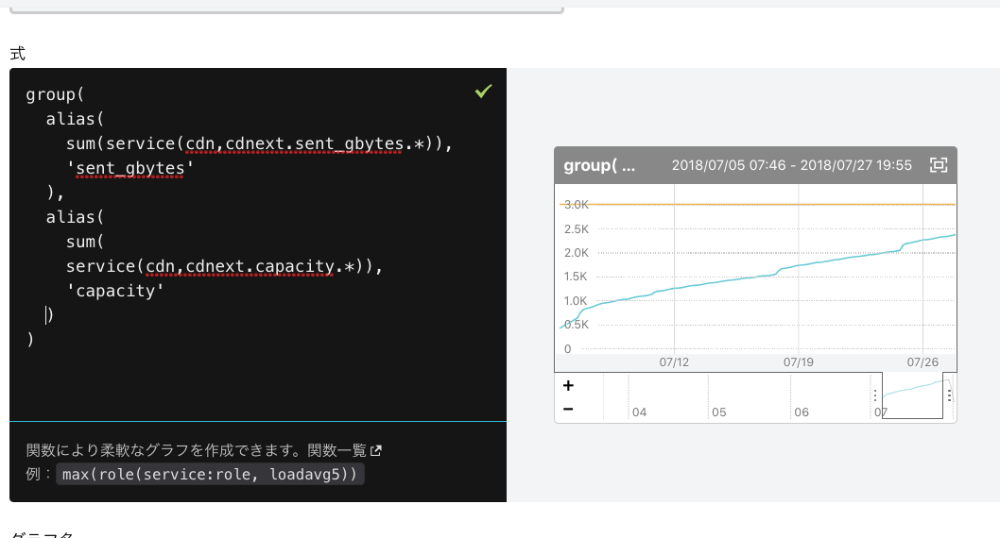

### フルマネージドホスティングの
### 運用監視に Mackerel を導入した話
--------
Kenichi Morimoto
2018 / 08 / 02
Mackerel Meetup #12

---

### もくじ
- 自己紹介
- 既存の監視・運用の問題点
- Mackerel 導入理由
- Mackerel 導入後
- 監視利用例

---

### 自己紹介
- 名前: 森本 健一
- @hogem
- 2006~ 
   - インフラエンジニア
- GCP Cloud Architect
- AWS Solutions Architect Associate

---

### 法人向けフルマネージド ホスティング

- 自社基盤メイン
    - 既存 ISP の回線設備を有効活用
    - クラウド基盤 VMware / 約700VM
    - 物理 専用サーバ、共用サーバ / 約500台
    - NW 機器 / 約300台
- パブリッククラウド
    - AWS、GCP、(Azure)

---

### 抱えていた問題
- ユーザへの障害通知のタイムラグ
- 混在している監視システム
- たびたび起こる監視設定の間違い
- 監視サーバの設計上の問題

---

### ユーザへの障害通知のタイムラグ
- 手動で連絡
    - 営業へのメール
    - 障害Webページへの掲載
- どうしても連絡が遅くなる
    - 同時に複数の障害が発生した場合
- 社内の複数部署と連携しているシステム

---

### 混在している監視システム
- Zabbix
- Pandora FMS
- Cacti (２つ)
- GrowthForecast

各担当者が個別に用意して運用が煩雑に

---

### Cacti

- L2/L3 SW の interface 全部 グラフにするとかは楽
- snmp、mib の知識が必要 (やや特殊)
- cacti plugin 作成の学習コスト 
- お手軽にグラフ描きたい！

---

### GrowthForecast
- cactiより簡単にグラフ化したいので採用！
- API経由でグラフ作成
- 単体ではアラート通知機能がない
- 通知の必要がない統計グラフに利用している

---

### Pandora FMS

- オープンソースの監視ソフトウェア
- クラウド基盤構築時に導入
- 子会社 (システム運用、監視、障害対応) にコミッタがいたので採用

---

### Pandora FMS 問題点
- リソース結構使う
- 普段は問題ない
    - 大規模障害時にアラート来なかった
- 監視サーバのスペック
    - CPU: Intel Xeon E5-2407 2.20GHz 4コア
    - Memory: 40GB

---

### Pandora FMS 監視数

- 監視ホスト数: 約600
- 監視項目数: 約3500

---

### リソース状況


```
$ sar 
00:00:00  CPU     %user     %nice   %system   %iowait    %steal     %idle
Average:  all     39.53      0.00     25.00      3.27      0.00     32.19
```

---

### 監視サーバの設計の問題
- 当初予算の制約
- 同一H/Wで監視とログサーバを兼ねていた
- Pandora FMS が想定よりリソース食う
- クラウド基盤と<span style="color: red">同一NW内</span>に監視サーバを配置

---

### ある日 大規模な NW 障害が発生
- NW 環境が不安定に
    - 一部のホストとストレージが切断
    - 約１時間、影響 数百VM
- Pandora 上はステータスが<span style="color: red">"不明"</span>となりアラート通知が飛ばなかった
- 後日調査: Pandora のリソース不足が原因だった可能性が高い

---

### たびたび起きる監視設定ミス
サーバ構築者が監視担当者に依頼
- 監視設定間違い (ex: ホスト、ポート)
- アラート送信設定間違い (ex: 送信未設定、宛先)
- サーバ構築者が監視依頼を忘れていた 😇

根本的な原因: <span style="color: red;">レビューがない </span>

---

### 当時抱えていた問題 (おさらい)
- 障害通知のタイムラグ
- 混在している監視システム
- たびたび起こる監視設定の間違い
- 監視サーバの設計上の問題

---

### Mackerel 導入理由
- 個々の課題の解決方法は色々あった
- Mackerel を使えば総合的に解決できそう
- SaaS / マネージドサービス 
- コスト比較
    - クラウドに Zabbix インスタンス 冗長構成
    - VPN、監視運用、管理

---

### 監視サーバの保守が不要

オンプレ or クラウド上で監視サーバ構築の場合
- クラスタ構成(PaceMaker等)、複数台構成
    - Pandora FMS, Zabbix, Zabbix Proxy
- 台数、容量増加時にスケールできる設計が必要

---

### プライベート NW 環境に導入しやすい
- セキュリティ要件の厳しい顧客のプライベートネットワーク環境
- api.mackerelio.com 443 port への outbound の許可があればOK
    - HTTP Proxy or NAT
    - 監視のために 443 通します、という説明は必要
- 監視サーバからのルーティング、FW許可などが不要

---

### 工夫したこと 

- 障害情報ページへのリアルタイムの反映
- オーガニゼーションをまたがった検索
- 顧客への通知メールのカスタマイズ 

---

### マネージドホスティング

- 原則 1顧客 1オーガニゼーション
    - 約 70 オーガニゼーション
- Mackerel 管理画面上でオーガニゼーションを超えてホスト、アラートが検索できない


---

### 構成図


---

### 自前ダッシュボードの作成

- GCP 上に GCE インスタンスを構築
    - 本当は App Engineを使ってみたかった 😇
    - 本番利用の実績がなく、実装までの時間の都合上断念
- Python + Flask + FlaskAdmin で作成
    - API Key の管理
    - 登録ホスト、アラート等を JSON で取得
    - オーガニゼーションごとのホスト数

---

### Flask Admin + SQLAlchemy

```python
class Organizations(db.Model):
    id       = db.Column(db.Integer, primary_key=True)
    name     = db.Column(db.String(50), nullable=False, index=True)
    apikey   = db.Column(db.String(50), nullable=False, unique=True)
    verified = db.Column(db.Boolean)
    private  = db.Column(db.Boolean)
    memo     = db.Column(db.String(200))

admin.add_view(ModelView(Organizations, db.session))
```

---

### 簡単に管理画面実装できる
<!--  -->


---

### JSON を元に出力した html

 

---

### JSON を元に出力した html (hosts)
<!--  -->


---

### 通知メールのカスタマイズ 
- Mackerel からの通知メール
    - From: noreply@mackerel.io
- 営業の要望
    - From の変更
    - メール本文のカスタマイズ
    - 簡単な内容で送って欲しい
    - service ごとに異なる宛先に送りたい

---

### Webhook request body 抜粋

 

---

### GCP 上に API 用意

- Flask で Webhook 受け取る
- JSON から orgName, hostname 等を取得
- <span style="color: red">1ホスト 1サービス で運用 </span>
- ユーザへのメール送信には SendGrid を利用

```
    user = db.session.query(Notifications).filter(
               Notifications.orgname == orgname, 
               Notifications.service == service).first()
```

---

### 死活監視の通知メール

 

---

### 書き換えたメール

- Mackerel のアラートID をケースID として通知
- 問い合わせの際にMackerel 上で追える

```

マネージドクラウド 障害を検知いたしました。

発生日時　　　： 2018-07-26 11:57:04
障害対象サーバ： vmXXXX
ケースID　　　： 3k73ZJscVcW

詳細については下記Webサイトをご確認ください。

```

---

### 補足: GCPのメール送信制限

- ポート 25 を宛先とする送信トラフィック（SMTP）はすべてブロックされます
- ポート 465 または 587 を宛先とするほとんどのトラフィック（SMTP over SSL）がブロックされます
- https://cloud.google.com/compute/docs/networks-and-firewalls


---

## 監視設定手順の簡略化

---

### Mackerel 導入後の構成

- エージェントインストールで死活監視は自動的に開始
- これだけで監視漏れがなくなる安心感が得られる

---

### アラートごとの宛先がわかりやすい


---

### Mackerel 導入前 URL 監視設定フロー 

- サーバ構築者が監視内容を<span style="color: red">excel</span>に記入
- サーバ構築者がチケットにexcelを添付
- 監視担当者がチケット内容を元に監視設定

辛い 😇

---

### Mackerel 導入後 (予定)

- 担当者が監視内容を設定
    - mkr monitors pull して編集
    - branch 切って commit, push (社内 Gitlab )
    - Merge Request 投げる
- チェック者が Merge
    - Gitlab CI で自動的に設定
        - mkr monitors push 

---

### cron を Mackerel に巻き取る

- 定期的なチェック処理等 
    - クリティカルなモノは結果を監視してる
    - 全部してない
- スクリプト個別に実装すると面倒
    - 失敗時の連続通知抑制
- 終了ステータスだけ調整すれば check plugin で出来る

---


## 監視利用例

---

### CDN
- CDN: J-Stream とパートナー契約
    - (利用状況次第で) AWSより転送単価安い
    - CloudWatch のような通知機能がない
    - APIで転送量取得は可能
- 転送量コミット xx TB / 月額 oo 万円  
- 容量超過時 xx 円 / GB

---

### CDNの転送量監視
- Mackerel でメトリック監視で解決 
    - サービスメトリックに投稿
    - 容量超過が発生したらアラート通知
    - グラフ共有で関係者に転送量状況を共有

---

### 7月の某ユーザのtraffic graph

 

---

### 公共機関 Web サイト - 大雨の日

 

---

### 契約容量を100 % としたグラフ
- このメトリックに監視を設定

 

---

### グラフ式 - 全ユーザの CDN 合計容量

 

---

### Mackerel 登録ホスト数の監視
- default では mackerel-agent.conf は一般ユーザで読み取り可能
    - API Key がわかる
    - chmod 600 mackerel-agent.conf し忘れたり
- 他部署に root 権限を渡している
    - 万が一、誤った操作されたら。。。
- 自前ダッシュボードのAPIが正常動作しているかの確認も兼ねてる


---

### 登録ホスト数


---

### 登録ホスト数を監視


---

## 要望

---

### 通知メールのテンプレート

- From、To
- Subject
- Body

---

### ホストのメモ情報

- マニュアルへの link とか書きたい
- メールには含まれていない
    - Webhookで飛んでくる JSON には含まれている

---

### 外形監視

- Mackerel で外部からの監視
    - URL 外形監視はある
    - 特定ホストの障害として紐づけたい
    - icmp, port 監視
- Mackerel 本体で全部やってくれたら嬉しい 
- もしくは OSS を使う
    - https://github.com/fujiwara/maprobe

---

### まとめ

- エージェントインストールだけで監視が始まる安心感
- API が豊富に提供されていて大抵のことはできる
- 運用監視を Mackerel に任せることでサービス提供に集中できる
